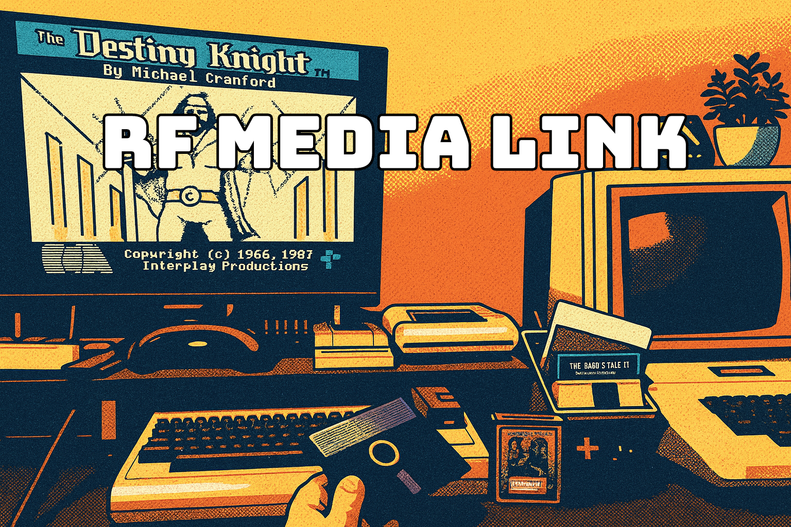

# RF Media Link - RFID Media Launcher

**Version:** 1.0.0

**RF Media Link** is a Windows background application that launches emulators, applications, files, and commands via RFID tags. Scan a tag attached to your vintage disk, cartridge, or cassette to instantly launch the corresponding emulator with the correct disk image or ROM pre-loaded. Also supports launching media players, opening files, navigating to URLs, or executing custom commands. Perfect for retro computing libraries, media collections, and content management workflows.

> **AI-Assisted Development Notice**
> 
> Hello, fellow human! My name is Aaron Smith. I've been in the IT field for nearly three decades and have extensive experience as both an engineer and architect. While I've had various projects in the past that have made their way into the public domain, I've always wanted to release more than I could. I write useful utilities all the time that aid me with my vintage computing and hobbyist electronic projects, but rarely publish them. I've had experience in both the public and private sectors and can unfortunately slip into treating each one of these as a fully polished cannonball ready for market. It leads to scope creep and never-ending updates to documentation.
> 
> With that in-mind, I've leveraged GitHub Copilot to create or enhance the code within this repository and, outside of this notice, all related documentation. While I'd love to tell you that I pore over it all and make revisions, that just isn't the case. To prevent my behavior from keeping these tools from seeing the light of day, I've decided to do as little of that as possible! My workflow involves simply stating the need to GitHub Copilot, providing reference material where helpful, running the resulting code, and, if there is an actionable output, validating that it's correct. If I find a change I'd like to make, I describe it to Copilot. I've been leveraging the Agent CLI and it takes care of the core debugging.
>
> With all that being said, please keep in-mind that what you read and execute was created by Claude Sonnet 4.5. There may be mistakes. If you find an error, please feel free to submit a pull request with a correction!

---

## Features

### Core Functionality
- **Background Service via Scheduled Task**: Runs at login with elevated privileges for proper window focus
- **ANSI Color Console Interface**: Modern, colorful configurator with automatic fallback for legacy terminals
- **Multiple Application Support**: Media players, emulators, file explorers, browsers, custom apps
- **Flexible Actions**: Launch applications, open files, navigate URLs, run commands
- **Customizable Arguments**: File paths, choices, toggles, and flags per application
- **Hot Reload**: Configuration changes detected automatically (no service restart needed)
- **JSON Configuration**: Easy backup, version control, and manual editing
- **Foreground Activation**: Launched applications automatically receive focus using ALT key simulation

### Enhanced Management
- **Numbered Tag Selection**: Select tags by number instead of typing full UIDs
- **Launch Tag Testing**: Test configured tags directly from configurator without scanning
- **Backup & Restore System**: Automatic and manual backups to Documents\RFMediaLink\Backups with smart change detection
- **Service Control**: Start, stop, and restart service directly from configurator
- **Log Viewer**: View Event Logs with filtering (Recent, Errors & Warnings, Today) and detailed inspection
- **Interactive Notifications**: MessageBox prompts for scan errors with option to launch configurator
- **Emulator Management**: View and edit emulator definitions from configurator
- **Auto-Reconnect**: Serial port automatically reconnects when RFID reader is unplugged/replugged
- **Centralized Version Management**: Single VERSION file with semantic versioning

> **Reader Compatibility Note**
> RF Media Link is built around a **custom serial RFID reader** for this project. See the parts list in [BOM.md](BOM.md) and the ESP32 serial firmware in [host_examples/esp32c3_rfid_reader_with_display.ino](host_examples/esp32c3_rfid_reader_with_display.ino). Most off‑the‑shelf HID/keyboard‑wedge readers will **not** work with the service.
> 
> **Future Idea (Not Implemented)**: A configurable input string format could be added later to support other serial readers. This is documentation‑only for now.
>
> **Platform Scope**: The end‑to‑end solution is **Windows‑only** right now. Porting to macOS/Linux would require additional work and is out of scope for this project.

---

## Quick Start

### Requirements

- **Windows 10/11** (.NET 8.0 runtime required)
- **RFID Reader**: This project requires a **serial-output reader** compatible with the custom firmware described in [host_examples/README.md](host_examples/README.md) (see the ESP32 example with display). HID/keyboard-wedge readers are **not supported**.
- **Applications**: Install your chosen media applications or emulators

### Installation

1. **Clone or download** this repository
2. **Build the projects** (or use pre-built binaries from releases):
   ```cmd
   build-release.bat
   ```

3. **Run the installer** (Right-click and "Run as administrator"):
   ```cmd
   cd deployment
   install.bat
   ```
   
   This will:
   - Copy binaries to `C:\ProgramData\RFMediaLink\`
   - Create a scheduled task to run at login with elevated privileges
   - Start the service immediately
   - Create desktop and Start Menu shortcuts
   - Copy default `emulators.json` configuration file

4. **Configure the serial port**:
   - Run the **RF Media Link Configure** shortcut, or
   - Edit `C:\ProgramData\RFMediaLink\config.json` manually
   - Set `serial_port` to your RFID reader's COM port (e.g., `"COM3"`)
   - Set `baud_rate` if different from 115200
   - The service will automatically reload when you save the file

5. **Service is running**:
   - The service starts automatically at login
   - Runs minimized in the background
   - Use Start Menu shortcuts to stop/start/restart as needed

### First Tag Setup

1. **Run the configurator**:
   - Click the **RF Media Link Configure** shortcut on your desktop, or
   - From Start Menu: Programs → RF Media Link → RF Media Link Configure

2. **Add a tag**:
   - Press `A` to add tag
   - Place RFID tag on reader (it will auto-scan into `scan_null.log`)
   - Or press Enter to type UID manually
   - Enter a name for the tag
   - Select action type `1` for emulator
   - Choose emulator from list
   - Configure arguments:
     - For **choice** fields (like model), select from numbered menu
     - For **file** fields (like media files), press `[B] Browse` to open file dialog or enter path
     - For **toggle** fields, enter `true`/`false` or press Enter for default
   - Confirm save

The catalog is saved immediately and the service will detect the change automatically (no restart needed).

3. **Test the tag**:
   - Scan the RFID tag
   - Application should launch with configured settings

---

## Configuration Files

All files are stored in `C:\ProgramData\RFMediaLink\`:

### `config.json`
```json
{
  "serial_port": "COM3",
  "baud_rate": 115200,
  "default_emulator": "applewin"
}
```

### `catalog.json`
Maps RFID UIDs to actions:
```json
{
  "66 DC 6E 05": {
    "name": "Apple II Game - Choplifter",
    "action_type": "emulator",
    "action_target": "applewin",
    "action_args": {
      "model": "apple2ee",
      "disk1": "D:\\Games\\Apple\\Choplifter.dsk",
      "fullscreen": "true"
    }
  }
}
```

### `emulators.json`
Defines available applications and their arguments:
```json
{
  "applewin": {
    "name": "AppleWin",
    "executable": "C:\\Emulators\\AppleWin\\AppleWin.exe",
    "arguments": [
      {
        "name": "model",
        "type": "choice",
        "label": "Apple II Model",
        "flag": "-model",
        "choices": ["apple2", "apple2p", "apple2e", "apple2ee"],
        "default": "apple2ee"
      },
      {
        "name": "disk1",
        "type": "file",
        "label": "Disk 1",
        "flag": "-d1"
      },
      {
        "name": "fullscreen",
        "type": "toggle",
        "label": "Fullscreen",
        "flag": "-f",
        "default": "false"
      }
    ]
  }
}
```

---

## Emulator Argument Types

When configuring tags, arguments support different types:

| Type | Description | Example |
|------|-------------|---------|
| **file** | Full path to a disk/ROM file | `D:\Disks\game.dsk` |
| **choice** | Select from predefined options | Model: `apple2ee` |
| **toggle** | Boolean flag | Fullscreen: `True` |
| **flag** | Value passed with flag | `-rom cartridge.bin` |
| **positional** | Value without flag | `game.rom` |

The configurator automatically shows:
- **Choice fields** as numbered menus
- **Toggle fields** with true/false prompts
- **File fields** with path input
- **Defaults** for all fields (press Enter to use)

### Quick Entry Mode

When adding tags, use shortcuts to speed up configuration:
- Press **Enter** alone: Use default value for field
- Type **S** after a field: Skip rest with empty values
- Type **D** after a field: Default rest with their default values

---

## Included Emulator Configurations

RF Media Link comes with configuration templates for popular emulators:

- **AppleWin**: Apple II emulator
- **Stella**: Atari 2600 emulator
- **FCEUX**: Nintendo (NES) emulator
- **SNES9x**: Super Nintendo emulator
- **Project64**: Nintendo 64 emulator
- **Classic99**: TI-99/4A emulator
- **VICE**: Commodore 64 emulator
- **TRS-80 GP**: TRS-80 emulator
- **Fusion**: Sega Genesis/Master System/SG-1000 emulator
- **mGBA**: Game Boy/Game Boy Color/Game Boy Advance emulator
- **Dolphin**: Nintendo GameCube emulator
- **Virtual Jaguar**: Atari Jaguar emulator
- **Mednafen**: Multi-system emulator (Game Gear, Atari Lynx, Virtual Boy, PlayStation)
- **RetroArch**: Multi-system emulator frontend

> **Note:** Emulator software is **not included**. You must download and install the emulators separately. The included `emulators.json` file provides pre-configured definitions with common command-line arguments for each emulator. Edit paths and arguments as needed for your installation.

To add more emulators, edit `emulators.json` manually with the same structure.

---

## How It Works

### Architecture

```
┌─────────────────┐
│  RFID Reader    │ USB Serial
│  (PN532/RC522)  │──────────┐
└─────────────────┘          │
                             ▼
                    ┌──────────────────┐
                    │ RF Media Link Service │
                    │  (Background)    │
                    └──────────────────┘
                             │
                    ┌────────┴────────┐
                    │                 │
         ┌──────────▼─────────┐  ┌───▼──────┐
         │  catalog.json      │  │ last_    │
         │  (UID→Action map)  │  │ scan.txt │
         └────────────────────┘  └──────────┘
                    │                 │
         ┌──────────▼─────────┐      │
         │ emulators.json     │      │
         │ (Emulator configs) │      │
         └────────────────────┘      │
                    │                 │
                    │            ┌────▼────────┐
                    └───────────►│ Configurator│
                                 │   (Tool)    │
                                 └─────────────┘
```

1. **Service monitors** serial port for RFID reader data
2. **On tag scan**:
   - Writes UID to `last_scan.txt` (for configurator)
   - **Reloads `catalog.json` from disk** (hot reload - no service restart needed!)
   - Looks up UID in catalog
   - Loads emulator config from `emulators.json`
   - Builds command-line arguments
   - Launches emulator process
3. **Configurator** reads `last_scan.txt` to detect scans while adding tags

### Scanning Workflow

The RFID reader sends data via serial in this format:
```
UID: 66 DC 6E 05
Type: Mifare Classic 1K
```

The service parses the UID, looks it up in `catalog.json`, and executes the mapped action.

---

## Configurator Usage

Run `configure.bat` or `RFMediaLink.exe` directly.

### Main Menu

```
═══════════════════════════════════════════════════════
  RF Media Link Configuration Tool - v0.9.0-dev
═══════════════════════════════════════════════════════
Config Location: C:\ProgramData\RFMediaLink

1. Manage Tags
2. View Emulators
3. Service Control
4. View Logs
5. Backup & Restore
6. Settings
7. Exit
```

### Service Control

From the main menu, select **"3. Service Control"** to:

1. **Start Service**: Launch the service via scheduled task
2. **Stop Service**: Terminate the running service
3. **Restart Service**: Stop and start in one action
4. **Check Service Status**: Verify if service is running

This eliminates the need to use PowerShell scripts or Task Manager for basic service management.

### Manage Tags

Shows all configured tags:
```
═══════════════════════════════════════════════════════
  Manage RFID Tags
═══════════════════════════════════════════════════════

1. [66 DC 6E 05] Apple DOS 3.3
2. [AA BB CC DD] Ultima IV

A. Add Tag
E. Edit Tag
D. Delete Tag
B. Back to Menu
```

### Adding Tags

1. **Place tag on reader** - Auto-scans (or press Enter to type manually)
2. **Enter tag name** - Descriptive name for your reference
3. **Select action type**:
   - `1` - Emulator (launch emulator with arguments)
   - `2` - File (open a file)
   - `3` - URL (open in browser)
   - `4` - Command (run shell command)
4. **Configure** based on action type:
   - **Emulator**: Select from list, configure arguments with menus for choices
   - **File/URL/Command**: Enter target path/URL/command

### Deleting Tags

1. Press `D` from Manage Tags menu
2. Enter UID of tag to delete
3. Confirm deletion

### Editing Tags

1. Press `E` from Manage Tags menu
2. Enter UID of tag to edit
3. Press Enter to keep existing values, or enter new values
4. For emulator tags, you can change the emulator and update arguments
5. Confirm save

### Launching Tags (Testing)

1. Press `L` from Manage Tags menu
2. Select a tag by number from the list
3. The configured action will execute immediately
4. Useful for testing tags without physically scanning them

Supports all action types:
- **Emulators**: Launches with configured disk images/ROMs
- **Files**: Opens files or URI schemes (e.g., `ms-phone:`, `mailto:`)
- **URLs**: Opens in default browser
- **Commands**: Executes shell commands

---

## Service Management

### Start/Stop/Restart

Use the Start Menu shortcuts or PowerShell:

```powershell
# Start via scheduled task
Start-ScheduledTask -TaskName "RF Media Link Service"

# Stop the service
Stop-Process -Name "RFMediaLinkService" -Force

# Restart
Stop-Process -Name "RFMediaLinkService" -Force; Start-Sleep -Seconds 2; Start-ScheduledTask -TaskName "RF Media Link Service"

# Check if running
Get-Process RFMediaLinkService -ErrorAction SilentlyContinue
```

Or use the provided scripts in `C:\ProgramData\RFMediaLink\`:
- `start-service.ps1`
- `stop-service.ps1`  
- `restart-service.ps1`

### View Logs

**Option 1: Built-in Log Viewer (Recommended)**

From the configurator main menu, select **"4. View Logs"** to access:

1. **View Recent Logs (Last 50)**: See the most recent service activity
2. **View Errors & Warnings**: Filter for issues only (errors, warnings, critical events)
3. **View All Logs Today**: See everything logged since midnight
4. **Open Event Viewer**: Launch Windows Event Viewer directly

The log viewer displays:
- Entry number (select by number for details)
- Timestamp
- Level (Information, Warning, Error, Critical)
- Message preview

Select any entry by number to view full details including:
- Complete message
- Event ID
- Task Category
- User and Computer information
- Structured data (when available)

**Option 2: Windows Event Viewer**

1. Open Event Viewer (`eventvwr.msc`)
2. Navigate to: **Windows Logs → Application**
3. Filter by source: **"RFMediaLinkService"**

**Option 3: PowerShell**

```powershell
# View recent logs
Get-WinEvent -FilterHashtable @{LogName='Application'; ProviderName='RFMediaLinkService'} -MaxEvents 50

# View errors and warnings only
Get-WinEvent -FilterHashtable @{LogName='Application'; ProviderName='RFMediaLinkService'; Level=1,2,3} -MaxEvents 50
```

### Notifications

The service displays **MessageBox notifications** for errors and issues:

**Tag Not Found:**
- Shows dialog: "Tag [UID] not in catalog. Open Configure to add this tag?"
- Click **Yes** to launch the configurator automatically
- Click **No** to dismiss

**Other Errors:**
- **Emulator not found**: Configured emulator doesn't exist
- **Launch failures**: Application failed to start

Notifications appear as modal dialogs that stay visible until dismissed. **Successful scans do not show notifications** to avoid interruption during normal operation.

### Update Service

After rebuilding:

```powershell
cd deployment
.\update-service.ps1
```

This stops the service, copies new binaries, and restarts.

### Uninstall

Right-click and "Run as administrator":

```cmd
cd deployment
uninstall.bat
```

---

## Troubleshooting

### Service won't start

1. Check if already running: `Get-Process -Name "RFMediaLinkService"`
2. Check serial port in `C:\ProgramData\RFMediaLink\config.json` matches your RFID reader
3. Verify .NET 8.0 Runtime is installed
4. Check Event Viewer (Windows Logs → Application, filter by "RFMediaLinkService")
5. Verify scheduled task exists: `Get-ScheduledTask -TaskName "RF Media Link Service"`
6. Try running manually (requires admin): Right-click `C:\ProgramData\RFMediaLink\RFMediaLinkService.exe` → Run as administrator

### Tag not recognized

1. Verify tag is in `C:\ProgramData\RFMediaLink\catalog.json`
2. Check UID format - service logs normalize case automatically
3. Check Event Viewer - service logs catalog loading and UID lookups
4. Verify scan is being detected - check `C:\ProgramData\RFMediaLink\scan_null.log`

### Emulator won't launch

1. Verify `executable` path in `emulators.json` is correct and points to the actual .exe file
2. Check disk/ROM file paths in `catalog.json` - must be full paths
3. Test emulator manually with same arguments
4. Check Event Viewer for "Error launching" messages with exception details

### Emulator launches but doesn't get focus

1. Verify service is running with elevated privileges via the scheduled task
2. Try manually: Right-click `RFMediaLinkService.exe` → Run as administrator
3. Check Event Viewer for window activation messages
4. The service uses ALT key simulation to bypass Windows focus stealing prevention

### Configurator doesn't detect scans

1. Verify service is running: `Get-Process RFMediaLinkService`
2. Check that `scan_null.log` is being updated in `C:\ProgramData\RFMediaLink\`
3. Restart service if needed

---

## Advanced Topics

### Custom Emulators

To add a new emulator, edit `emulators.json`:

```json
{
  "myemulator": {
    "name": "My Emulator",
    "executable": "C:\\Path\\To\\emulator.exe",
    "arguments": [
      {
        "name": "rom_file",
        "type": "file",
        "label": "ROM File",
        "flag": "-rom",
        "required": true
      },
      {
        "name": "fullscreen",
        "type": "toggle",
        "label": "Fullscreen",
        "flag": "-fullscreen",
        "default": false
      }
    ]
  }
}
```

Then restart the service: `Restart-Service "RF Media Link"`

### Non-Emulator Actions

You can map tags to other actions by editing `catalog.json`:

**Open a file:**
```json
{
  "AA BB CC DD": {
    "name": "Documentation",
    "action_type": "file",
    "action_target": "D:\\Docs\\manual.pdf"
  }
}
```

**Open a URL:**
```json
{
  "11 22 33 44": {
    "name": "Retro Gaming Site",
    "action_type": "url",
    "action_target": "https://www.retrogaming.com"
  }
}
```

**Run a command:**
```json
{
  "AA BB CC DD": {
    "name": "Backup Script",
    "action_type": "command",
    "action_target": "C:\\Scripts\\backup.bat"
  }
}
```

### Backup and Restore

All configuration is in JSON files in `C:\ProgramData\RFMediaLink\`:

```powershell
# Backup
Copy-Item "$env:ProgramData\RFMediaLink\*.json" "D:\Backup\"

# Restore
Copy-Item "D:\Backup\*.json" "$env:ProgramData\RFMediaLink\"
Restart-ScheduledTask -TaskName "RF Media Link Service"
```

---

## Development

### Project Structure

```
RF Media Link/
├── RFMediaLinkService/       # Windows Service (C# .NET 8.0)
│   ├── RfidWorker.cs         # Core service logic
│   ├── Program.cs            # Service host setup
│   └── RFMediaLinkService.csproj
├── RFMediaLink/              # Configuration tool (C# .NET 8.0)
│   ├── Program.cs            # Console UI
│   └── RFMediaLink.csproj
├── deployment/               # Installation scripts & binaries
│   ├── install-rfmedialink.ps1
│   ├── update-service.ps1
│   ├── uninstall.bat
│   └── configure.bat
├── host_examples/            # Example RFID reader firmware
│   ├── esp32c3_rfid_reader_serial_only.ino
│   ├── esp32c3_rfid_reader_with_display.ino
│   └── rp2040_rfid_reader_micropython.py
├── BOM.md                    # Hardware bill of materials
└── README.md                 # This file
```

### Building from Source

**Requirements:**
- .NET 8.0 SDK
- Windows 10/11

**Build steps:**

```powershell
# Build service
cd RFMediaLinkService
dotnet publish -c Release

# Build configurator
cd ..\RFMediaLink
dotnet publish -c Release

# Copy to deployment
Copy-Item "RFMediaLinkService\bin\Release\net8.0-windows\publish\*" "deployment\build\" -Recurse -Force
```

### Contributing

1. Fork the repository
2. Create a feature branch
3. Make your changes
4. Test thoroughly
5. Submit a pull request

---

## Hardware

See [BOM.md](BOM.md) for hardware recommendations and wiring diagrams for building your own RFID reader.

Compatible RFID modules:
- PN532 (I2C/SPI/UART)
- RC522 (SPI)
- RDM6300 (UART)

Compatible microcontrollers:
- ESP32-C3
- RP2040 (Raspberry Pi Pico)
- Arduino compatible boards

Example firmware is provided in the `host_examples/` directory for ESP32-C3 and RP2040.

---

## License

This project is provided as-is for hobbyist and personal use.

---

## Credits

- **Author**: Aaron Smith
- **AI Assistant**: Claude Sonnet 4.5 via GitHub Copilot
- **Emulator Developers**: AppleWin, Stella, FCEUX, SNES9x, Project64, Classic99, VICE, TRS-80 GP, Fusion, mGBA, Dolphin, Virtual Jaguar, Mednafen, and RetroArch teams

For questions, issues, or contributions, please open an issue on GitHub.
